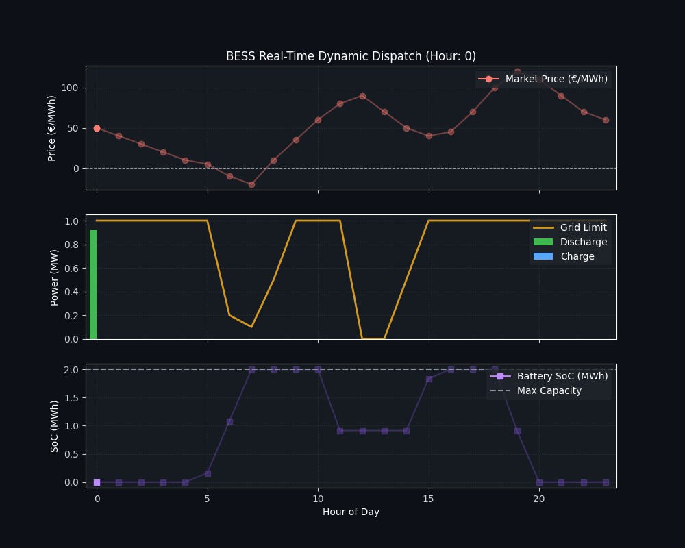

# Flexible BESS Dispatch & Arbitrage Optimizer under Dynamic Grid Constraints

An advanced quantitative optimization framework designed for Battery Energy Storage Systems (BESS) operating in high-penetration renewable markets (such as Germany / EPEX Spot).

The model addresses a critical modern challenge for IPPs: **Co-optimizing multi-market arbitrage while adhering to dynamic, non-firm grid export limits and mitigating degradation costs.**

---
### Visualization
The optimization engine successfully shifts charging cycles into negative-price windows and shapes multi-hour discharges around strict grid export bottlenecks:

<p align="center">
  
</p>

### Key Features
* **Mixed-Integer Linear Programming (MILP):** Formulated using `PuLP` to ensure mathematically optimal dispatch schedules.
* **Non-Firm Grid Constraints:** Dynamically restricts power injection during peak solar/wind congestion hours.
* **Negative Price Handling:** Automatically capitalizes on negative electricity price intervals by treating charging during oversupply hours as a revenue source.
* **Degradation-Aware Logic:** Integrates binary variables to eliminate simultaneous charge/discharge behavior and explicitly models cell throughput wear-and-tear costs.
* **Real-Time API Integration:** Supports live European day-ahead market data retrieval via `entsoe-py`.

---

### Project Structure
```text
bess-flexible-dispatch-optimizer/
│
├── data/
│   └── market_prices_fallback.csv
├── notebooks/
│   └── optimization_demo.ipynb
├── src/
│   └── optimizer.py
├── .gitignore
├── LICENSE
├── README.md
└── requirements.txt
---

### Sample Fallback Market Data & Constraints (`market_prices_fallback.csv`)

| Hour | Price (€/MWh) | Grid Limit (MW) | Description / Market Condition |
| :--- | :--- | :--- | :--- |
| **00:00** | 40.00 | 1.0 | Standard Base Load |
| **05:00** | -15.00 | 1.0 | Early morning low demand / negative pricing |
| **06:00** | -45.00 | 0.3 | Peak solar surge & strict grid congestion |
| **07:00** | -20.00 | 0.1 | Severe bottleneck (Minimum export limit) |
| **12:00** | 110.00 | 0.0 | Full grid curtailment (Zero export allowed) |
| **19:00** | 150.00 | 1.0 | Evening peak demand window |
